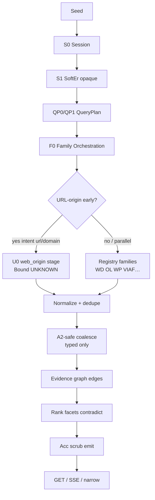

# 05 — TARGET TO-BE PIPELINE · CYCLE1 ARCHITECTURE EVOLUTION DESIGN

**Stamp:** 2026-09-20T12:31:00+03:00 IDT · DESIGN-ONLY · NO CODE  
**Ground:** Integration Review minimum evolution · PHASE5 S1.5 QueryPlan note

---

## Target flow (minimum evolution)

```text
seed
  │
  ├─ [STAYS] S0 session mint · budgets · store
  ├─ [STAYS] softEntityResolve → opaque seed:<hash> (non-identity)
  ├─ [STAYS] urlSafety before any fetch
  │
  ├─ ★ QP0  SeedClass + Intent classify          (07 · 11)
  ├─ ★ QP1  QueryPlanBuilder                     (06)
  │         → plan steps · queries[] · families[] · caps · reasons
  │
  ├─ ★ F0   Source-family orchestration          (08 · 09)
  │         → select enabled families · allocate budgets · Preview flags
  │
  ├─ ★ U0   URL-origin EARLY stage (when plan says so)  (10)
  │         → C1 contract · metadata-only · one-hop · Bound UNKNOWN
  │         → may run before or parallel to registry families per plan
  │
  ├─ [STAYS] Provider/family adapters execute planned queries (NOT raw seed-only)
  ├─ [STAYS] normalize · fingerprint dedupe
  ├─ [STAYS] A2-safe coalesce (typed SAME-REFERENCE ceiling) when flag on
  ├─ ★ G0   Relationship edges on evidence graph (12)
  │         → vocabulary labels · no dossier
  ├─ [STAYS] rank · facets · contradictions
  ├─ ★ OBS  Attach plan summary to session/obs   (13 · 14)
  └─ [STAYS] Acc scrub emit → progressive GET / SSE / narrow
```

---

## Mermaid (TO-BE)



---

## Stage ownership (design)

| Stage | Owner concept | Mutates identity? |
|-------|---------------|-------------------|
| QP0/QP1 QueryPlan | Orchestration | **NO** — search intent only |
| F0 Family orchestrator | Orchestration | **NO** |
| U0 URL-origin early | Reuse C1 Bound | **NO** — UNKNOWN for URL-alone |
| A2 coalesce | Existing Preview | SAME-REFERENCE typed only |
| G0 edges | Graph complement | Labels only · no dossier |
| Acc emit | Existing | Scrub |

---

## What changes vs AS-IS (design delta)

| AS-IS | TO-BE |
|-------|-------|
| Verbatim `q: session.seed` to all providers | Plan-selected queries per family/step |
| Flat provider array | Family registry + independence budgets |
| WEB-ORIGIN as optional provider + ad-hoc one-hop | Planned **early stage** when intent is url/domain; one-hop still capped |
| No plan in session | `queryPlan` summary visible in obs (scrubbed) |
| Graph = corroboration edges only | + explicit relationship vocabulary edges |

---

## What does NOT change

B0 default provider set without Chief GO · Core · Acc scrub obligation · urlSafety · A2-bound rejection · C1 URL→UNKNOWN Bound · no crawl · progressive SSE protocol compatibility (additive fields only).

---

## Progressive compatibility

First paint may still emit early provider batches; QueryPlan summary SHOULD be available by first durable snapshot after QP1 (design). SSE event types remain backward-compatible; new optional event `plan` / field on snapshot — see 13.

---

## STOP

TO-BE is design target. **No implementation in this pack.**
