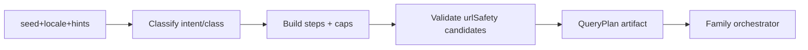

# 06 — QUERYPLAN SPEC · CYCLE1 ARCHITECTURE EVOLUTION DESIGN

**Stamp:** 2026-09-20T12:31:00+03:00 IDT · DESIGN-ONLY · deterministic contract · NO IMPL  
**Ground:** PHASE5 “explicit S1.5 QueryPlan” · Integration Review §1

---

## Purpose

A **QueryPlan** is a deterministic, explainable, budget-aware **search-intent schedule**.

> **SEARCH INTENT ≠ ENTITY TRUTH**

It answers: *what should we try to discover next, from which source families, under which caps?*  
It **MUST NOT** answer: *who/what is this entity?*

---

## Inputs (read-only)

| Input | Type | Notes |
|-------|------|-------|
| `seed` | string | Bounded by MAX_SEED_CHARS |
| `locale` | string | Caller locale; default `en` |
| `hints` | object | Opaque; may include facet/role cues — never Core identity |
| `seedClass` | enum | From 07/11 router (design) |
| `intents` | enum[] | From 07 taxonomy |
| `knownTypedRefs` | string[] | Existing `qid:`/`viaf:`/`ol:` on session — **not invented** |
| `urlCandidates` | string[] | Extracted/normalized candidates (pre-urlSafety) |
| `budgetsRemaining` | object | Wall / per-family / hop caps |
| `flags` | object | Preview flags (VIAF, WEB_ORIGIN, future plan flag) |
| `findings` / `evidence` | arrays | May be empty at first plan |

---

## Outputs

| Output | Description |
|--------|-------------|
| `planId` | Stable id for obs/replay |
| `seedClass` | Echo classification |
| `intents` | Ordered intent ids |
| `steps[]` | See step shape below |
| `stopConditions` | When to halt further fanout |
| `reasons[]` | Explainable selection rationale (no secrets) |
| `caps` | Global caps applied |

### Step shape (design)

```text
{
  stepId,
  intent,                 // from 07
  purpose,                // short machine+human reason
  riskClass,              // low | medium | high (fanout/SSRF risk)
  query,                  // provider-facing string OR structured lookup
  facetHints[],           // constraints — not vanity queries
  families[],             // SourceFamilyId from 08/09
  urlTargets[],           // for URL-origin stage only; post-normalize
  budgetMs,
  maxFindingsHint,
  parallelGroup,          // steps sharing a group may run parallel
  dependsOn[]             // optional stepIds
}
```

### Forbidden outputs

Identity conclusions · SAME-ENTITY claims · title-bridge directives · domain-ownership assertions · silent budget expansion · credentials · Acc-forbidden identities · crawl frontiers.

---

## Seed classification → plan (normative sketch)

| Class (07) | Primary steps | Families (typical) | Caps (design defaults) |
|------------|---------------|--------------------|------------------------|
| `name` | registry search on head token | wiki · wd · ol · viaf(flag) | ≤1 query rewrite; ≤N families |
| `url` / `domain` | **U0 URL-origin early** then optional registry on hostname label | web_origin → wd/wiki | hops ≤5 total; one-hop only |
| `role` / `compound` | split head entity query + constraint facetHint | wiki · wd · viaf(flag); demote OL-author on org cue | ≤2 queries (head + optional org token) |
| `underspecified` | single conservative registry pass OR honest empty | wiki · wd | no expansion |
| + `locale_hint` | attach locale to WD/WP hosts; dual-locale = future Preview | wikimedia family still one independence family | no vanity double-count |

Exact taxonomy: **07**. Entity-type subsets: **11**.

---

## Caps (design — not live-tuned)

| Cap | Design default | Rationale |
|-----|----------------|-----------|
| Max plan steps | 6 | Fanout blowup control |
| Max distinct queries | 4 | PHASE5 noise stance |
| Max families/session | 5 | Budget wall |
| Max URL targets | 5 (`MAX_ONE_HOP_URLS`) | C1 reuse |
| Max one-hop from findings | 3 (as-is C1) | No crawl |
| Spelling variants | 0 in minimum | Defer |
| Relationship fanout | 0 in minimum | Defer until head resolution |

---

## Failure modes (plan-level)

| Mode | Behavior |
|------|----------|
| Empty seed | Reject at S0 (existing 400) |
| Classify conflict | Prefer safer class (`underspecified` / `url` if looksLikeUrl) |
| All families disabled/skipped | Plan with reasons; session may complete empty honestly |
| URL normalize fail | Drop target · continue other steps · no SAME-* |
| Budget exhausted mid-plan | Mark remaining steps `skipped_budget` |
| Acc scrub on plan reasons | Strip forbidden ids from reasons/telemetry |

---

## Mermaid (plan build)



---

## Observability hooks

Emit `planId`, `seedClass`, `intents`, per-step `families`, `skipped_*` counts into session snapshot (scrubbed). KPI: plan hit rates — see 14.

---

## STOP

Contract only. **No QueryPlan implementation in this pack.**
