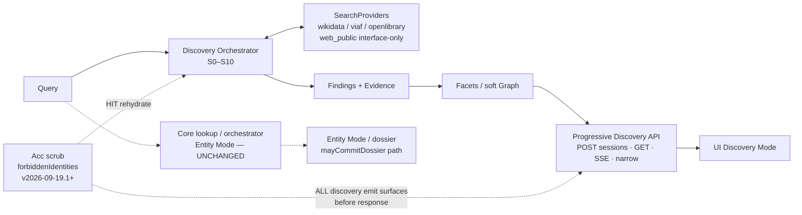

# Phase A · ARCHITECTURE FREEZE PACK · ארכיטקט · 2026-09-20

**STATUS:** **FROZEN v1.0** (SERVER+UX+QA+Acc folded) · **DOCS ONLY** · PROD `dpl_7vAA…` **FROZEN** · Acc P0 promote **CLOSED on `dpl_8ag…`** · **Phase B HOLD** · **WP4 NO-GO**  
**Product:** MAXIMUM PUBLIC DISCOVERY ENGINE — **not** People Search

**Addendum:** `PHASE-A-ENTITY-AGNOSTIC-ADDENDUM-ארכיטקט-2026-09-20.md` · Vertical Slice ≥3 Seeds · no entity special-case  
**Credit:** SERVER contribution folded from `PHASE-A-SERVER-שרת-2026-09-20.md` (canonical for Orchestrator S0–S10, SearchProvider, progressive API+session, cache, RL/retry, obs, finding dedupe/rank, Acc scrub on discovery surfaces, Core boundary). Arch owns this pack and Arch-canonical schemas.

### Principles (locked)
| # | Principle |
|---|-----------|
| P1 | INFORMATION ≠ IDENTITY |
| P2 | Provenance mandatory |
| P3 | Evidence-backed relationships only |
| P4 | Dynamic facets · User narrows |
| P5 | UNKNOWN ≠ FALSE |
| P6 | same name ≠ same person |
| P7 | no unjustified information loss |
| P8 | public / authorized only |
| P9 | additive Discovery Layer |
| P10 | DO NOT DESTROY CORE |

---

## Items 1–20 → section map

| Item | Topic | Section(s) | Owner / source |
|------|-------|------------|----------------|
| 1 | Architecture diagram (Query→Orchestrator→Providers→Findings→Facets/Graph→API→UI; Core parallel) | **A** | Arch |
| 2 | Data schemas (Finding, Evidence, Entity, Relationship, Facet, ImageProvenance, Session) | **B** + `schemas/` | Arch (+ SERVER stubs for finding/evidence/session) |
| 3 | Progressive Discovery API contracts | **C** | SERVER folded |
| 4 | Discovery lifecycle S0–S10 | **D** | SERVER folded |
| 5 | SearchProvider abstraction + provider map | **E** | SERVER folded |
| 6 | Evidence model (provenanceUrl, cite-or-drop, robotsOk) | **F** | Arch + SERVER |
| 7 | Entity Resolution rules (soft refs, merge rules, UNKNOWN≠FALSE) | **G** | Arch + Acc (@דיוק) **FOLDED** |
| 8 | Dynamic Facets algorithm | **H** | Arch |
| 9 | Discovery UI flow | **I** | @ממשק FOLDED |
| 10 | Vertical Slice acceptance (דוד כהן) | **J** | בודק FOLDED |
| 11 | Test matrix | **K** | בודק FOLDED |
| 12 | Perf / scale assumptions | **L** | SERVER budgets + Arch |
| 13 | Security / privacy | **M** | Arch + SERVER Acc scrub |
| 14 | Acc scrub on ALL discovery emit surfaces (forbiddenIdentities v2026-09-19.1+) | **A, C, G, M** | SERVER + Acc **FOLDED** |
| 15 | Cache (source-aware; no Core poison; HIT rehydrate scrub) | **L** (cache subsection) + SERVER §5 | SERVER folded |
| 16 | Budgets / rate-limit / retry | **L** + SERVER §6 | SERVER folded |
| 17 | Observability fields | **L** (obs) + SERVER §7 | SERVER folded |
| 18 | Finding dedupe (evidence fingerprint) | **D** S5 + SERVER §8 | SERVER folded |
| 19 | Ranking of FINDINGS (not identity) | **D** S8 + SERVER §9 | SERVER folded |
| 20 | Core boundary (Discovery never mayCommitDossier; Core /api/lookup unchanged) | **A, C, G, J** | SERVER folded |

---

## A. Architecture diagram



**ASCII (same):**

```
Query
  ├─► Discovery Orchestrator (S0–S10)
  │     ↔ SearchProviders (wikidata, viaf, openlibrary; web_public interface-only Phase A)
  │     → Findings + Evidence
  │     → Facets / soft Graph (evidence-backed edges only)
  │     → Progressive API (sessions / events SSE / narrow)
  │     → UI Discovery Mode
  │
  └─► Core lookup/orchestrator ──► Entity Mode (UNCHANGED; mayCommitDossier)
                                    Discovery NEVER calls this path

Acc scrub (forbiddenIdentities v2026-09-19.1+)
  on ALL discovery emit surfaces before response:
  candidates-equivalent · graph node ids · facet value ids · cache HIT rehydrate
```

**Boundary (SERVER §3, folded):** Discovery Orchestrator emits Findings/Evidence/Facets only. Never writes dossier. Acc scrub reuses SoT `forbiddenIdentities.js` v2026-09-19.1+.

---

## B. Data schemas

Canonical files under `test-results/discovery/schemas/`:

| Schema file | Role | Status |
|-------------|------|--------|
| `finding.schema.json` | Finding | SERVER stub — **accepted Phase A canonical** |
| `evidence.schema.json` | Evidence | SERVER stub — **accepted Phase A canonical** |
| `discovery-session.schema.json` | DiscoverySession | SERVER stub — **accepted Phase A canonical** |
| `entity.schema.json` | Entity (soft) | **Arch canonical** (this pack) |
| `relationship.schema.json` | Relationship | **Arch canonical** (this pack) |
| `facet.schema.json` | Facet | **Arch canonical** (this pack) |
| `image-provenance.schema.json` | ImageProvenance | **Arch canonical** (this pack) |

### Summaries

**Finding** (`finding.schema.json`): `id`, `kind` ∈ {page|registry|document|contact_public|media|other}, `title`, optional `summary`, `evidenceIds` (minItems 1), `providers` (minItems 1), optional `facetHints[]`, `entityRefs[]` (**soft refs only — not identity commit**), optional `scoreFinding` 0–1. `additionalProperties: false`.

**Evidence** (`evidence.schema.json`): `id`, **`provenanceUrl` (required, uri)**, `providerId`, `retrievedAt`, optional `quote`, `contentType`, `licenseHint`, `robotsOk`. No Finding without ≥1 Evidence. Cite-or-drop.

**Entity** (`entity.schema.json`): `id`, `kind` ∈ {person|org|place|other}, `displayName`, `softRefs[]`, `evidenceIds[]`, `confidence` 0–1 (**soft only**), `status` ∈ {candidate|corroborated|unknown}. **NOT** identity commit; **no faces**. `additionalProperties: false`.

**Relationship** (`relationship.schema.json`): `id`, `type` ∈ {works_at|owns|mentions|located_at|contact_of|other}, `fromEntityId`, `toEntityId`, `evidenceIds` **minItems 1**, `strength` 0–1. **No edge without Evidence.**

**Facet** (`facet.schema.json`): `key`, `label`, `buckets[{value, count, evidenceHint?}]`, optional `emptyReason`.

**ImageProvenance** (`image-provenance.schema.json`): `id`, `imageUrl`, **`sourcePageUrl` (required)**, `providerId`, optional `licenseHint`, `retrievedAt`, `robotsOk`. Never emit image without `sourcePageUrl`.

**DiscoverySession** (`discovery-session.schema.json`): `sessionId`, `q`, `status` ∈ {running|partial|complete|failed_soft}, `findings` (id refs), `facets`, `forbiddenIdentitiesVersion` (required), optional `progress`, `providers`, `forbiddenStripped`.

---

## C. API contracts (SERVER §4 folded)

| Method | Path | Purpose |
|--------|------|---------|
| `POST` | `/api/discovery/sessions` | create `{ q, locale?, hints? }` → `{ sessionId, pollAfterMs }` |
| `GET` | `/api/discovery/sessions/:id` | snapshot `{ status, findings[], facets[], cursor, progress }` |
| `GET` | `/api/discovery/sessions/:id/events` | SSE progressive chunks |
| `POST` | `/api/discovery/sessions/:id/narrow` | apply facet filters → server recompute |

### Session model (SERVER, folded)
```
DiscoverySession {
  sessionId, q, createdAt,
  status: running | partial | complete | failed_soft,
  providers: Record<providerId, pending|ok|partial|error|skipped>,
  findings: Finding[],   // append-only ids; body by ref
  facets: FacetState,
  progress: { done, totalHint? },
  budgets: BudgetLedger,
  forbiddenIdentitiesVersion: string
}
```

### Progressive rules
- First paint ≤ **800ms** with whatever providers finished.
- Later chunks **additive** · never silently remove prior Finding without **tombstone + reason**.
- `partial: true` until all providers terminal or session budget exhausted.

### Explicit identity-commit ban on Discovery responses
Discovery responses **MUST NOT** include:
- `dossier` / dossier commit payloads
- `faces` / face embeddings / face match scores
- `photoUrl` identity-commit fields (Identity Mode photo binding)

Images, if ever present on Discovery surfaces, require `ImageProvenance` with `sourcePageUrl` — and still are **not** identity commits.

Acc scrub runs on **all** emit surfaces before response (item 14).

---

## D. Discovery lifecycle — S0–S10 (SERVER §1 folded)

| # | Stage | Output | Budget default |
|---|--------|--------|----------------|
| S0 | Session bind | `sessionId`, query, locale | — |
| S1 | Plan | provider plan + facet seeds | 50ms CPU |
| S2 | Fan-out providers | raw hits | per-provider timeout |
| S3 | Normalize | `Finding[]` | — |
| S4 | Evidence attach | `Evidence[]` linked | — |
| S5 | Dedupe | merge by **evidence fingerprint** | — |
| S6 | Relationship hints | optional edges (**evidence-backed only**) | soft |
| S7 | Facet aggregate | facet buckets (counts) | — |
| S8 | Rank **findings** | order by evidence strength / diversity — **not** identity confidence | — |
| S9 | Acc surface scrub | forbidden QID strip on **all** discovery surfaces | hard |
| S10 | Progressive emit | SSE/chunk or poll cursor | — |

### Non-goals (orchestrator)
- Identity commit / faces / dossier
- Private / auth-walled sources
- Ranking people as “the one”

### Dedupe (SERVER §8 → S5)
Merge when **same evidence fingerprint** = hash(canonicalUrl + normalized quote/span + provider).  
Different URLs about same name → **keep both** (INFORMATION ≠ IDENTITY).  
Never drop a public Finding only because Entity Resolution is uncertain.

### Ranking (SERVER §9 → S8)
Signals: evidence freshness, source diversity, facet relevance after narrow, provider reliability.  
**Forbidden:** boosting a Finding because it “looks like the person.”

---

## E. Provider abstraction (SERVER §2 folded)

```ts
/** Phase A contract — sketch only */
interface SearchProvider {
  id: string;                 // 'wikidata' | 'viaf' | 'openlibrary' | 'web_public' | …
  capabilities: ('person_name'|'org'|'site'|'doc'|'contact_public')[];
  robotsPolicy: 'respect';    // hard — no bypass
  authMode: 'none'|'user_oauth_future'; // Phase A: none only
  search(req: ProviderSearchRequest, ctx: ProviderContext): Promise<ProviderBatch>;
}

interface ProviderSearchRequest {
  q: string;
  sessionId: string;
  cursor?: string;
  budgetMs: number;
  locale?: string;
  hints?: { org?: string; city?: string; site?: string };
}

interface ProviderContext {
  signal: AbortSignal;
  obs: ObsHandle;
  rateLimiter: RateLimiter;
}

interface ProviderBatch {
  providerId: string;
  findings: RawFinding[];     // pre-normalize
  nextCursor?: string;
  partial: boolean;           // true if truncated by budget/RL
  errors?: ProviderError[];   // soft — never fail whole session
}
```

### Provider rules
- Public/authorized URLs only · honor robots · no credential stuffing
- Errors are **soft** (degrade provider, continue session)
- Must return provenance URL per raw hit or hit is **dropped at S3**

### Provider map (Phase A — declare, not implement)

| Provider | Public surface | Notes |
|----------|----------------|-------|
| wikidata | wbsearchentities / entity pages | Acc scrub on Q-ids |
| viaf | AutoSuggest | registry |
| openlibrary | authors search | registry |
| web_public | **interface only** in Phase A | concrete crawler = Phase B+ after Acc-on-prod |

---

## F. Evidence model

| Rule | Spec |
|------|------|
| provenanceUrl | **Required** on every Evidence (`format: uri`) |
| Finding ↔ Evidence | No Finding without `evidenceIds` minItems 1 |
| robotsOk | Prefer true; honor robots — no bypass |
| cite-or-drop | If cannot cite a public provenance URL → **drop** the hit at S3/S4 |
| quote | Optional span supporting the Finding title/summary |
| Image | Via `ImageProvenance` only; `sourcePageUrl` required; never bare `imageUrl` |

Evidence fingerprint (dedupe key): `hash(canonicalUrl + normalizedQuote + providerId)`.

---

## G. Entity Resolution, Acc invariants, and Core boundary (Arch + Acc · FOLDED)

**Canonical Acc source:** `PHASE-A-ACC-דיוק-2026-09-20.md`. The Arch ER rules below remain in force where they do not conflict; **Acc is canonical for Acc invariants**. Discovery is a public-web findings engine, not an identity guesser: INFORMATION ≠ IDENTITY, UNKNOWN ≠ FALSE, and no false identity binding.

### G.1 Acc invariants `ACC-DISC-01…06`

| Invariant | Locked rule |
|-----------|-------------|
| `ACC-DISC-01` | Forbidden QIDs from SoT `forbiddenIdentities` v2026-09-19.1+ are stripped, not demoted, from every Discovery surface; leakage count = **0**. |
| `ACC-DISC-02` | Discovery Mode exposes Findings + Evidence + Facets only; no `mayCommitDossier` or identity-certainty copy. Entity Mode is entered only from an evidence-backed Finding or Acc-safe Core `uiState`; false entry is Acc FAIL. |
| `ACC-DISC-03` | `UNKNOWN ≠ FALSE`; uncertain bindings remain UNKNOWN / `need_context`, never a false non-identity assertion. |
| `ACC-DISC-04` | No unjustified information loss: conflicts keep both Findings visible and are surfaced, not silently dropped. |
| `ACC-DISC-05` | Merge/bind only on explicit Evidence links (provenance URL + typed relation); same name, co-occurrence, and soft refs are hints only. |
| `ACC-DISC-06` | Rank Findings by evidence strength, source diversity, freshness, and facet relevance—not by “who is this person”; a forbidden QID may not appear even as a weak ranked row. |

### G.2 Mandatory Acc scrub surfaces

Forbidden QIDs must never be emitted or reintroduced on any of these surfaces:

| Surface | Acc rule |
|---------|----------|
| Core dossier / `qid` | NEVER forbidden |
| `candidates[]` (Core or Discovery-equivalent) | NEVER forbidden id/qid |
| Findings list / cards | NEVER paint forbidden as `entityRef` |
| Facet value IDs | NEVER emit forbidden QID as a facet value |
| Discovery Graph nodes/edges | NEVER use forbidden QID as a node id or endpoint |
| Progressive API partials / SSE | Scrub every chunk before emit, including late events |
| Cache HIT rehydrate | Re-scrub on HIT before response |
| UI HTML / CTA / client store | Never reintroduce stripped IDs; server scrub is SoT and the client belt is mandatory |

### G.3 Mode gates

| Mode | Locked contract |
|------|-----------------|
| **Discovery Mode** | Findings + Evidence + Facets only; no `mayCommitDossier`, dossier, faces, or identity-certainty copy. |
| **Entity Mode** | Enter only from evidence-backed Finding / Acc-safe Core `uiState`; provenance is required and conflicts stay visible. |
| **Back to Discovery** | Same session; forbidden IDs are never rehydrated or painted. |

### G.4 ER merge rules

- `Finding.entityRefs` and Entity `softRefs` remain soft until evidence supports a merge.
- Same display name **≠** same person. Different URLs/sources about the same name stay as distinct soft Findings/entities.
- Soft refs, co-occurrence, and name similarity are hints only; they are not merge gates.
- Merge/bind **only** with explicit Evidence links: provenance URL(s) plus a typed relation. Evidence fingerprint dedupe may merge duplicate evidence representations, not people.
- Conflicts keep both Findings, surface the conflict, and do not silently drop information.
- `Entity.confidence` is a soft ranking aid only, never an identity-commit score. `status: unknown` is valid and preferred over a false bind.
- No relationship edge without Evidence; no identity commit, faces, or dossier in Discovery.

### G.5 Ranking Acc

Rank **Findings**, not identities, using evidence strength, source diversity, freshness, provider reliability, and facet relevance after narrow. Forbidden QIDs are stripped before ranking/emit and may not appear as a “weak” ranked row, candidate, facet, or graph node. Geo-token score contamination (for example New York → Q1701775) is the `F-L2-ACC-001` failure class; Phase A locks the scrub and leaves ranking redesign out of scope.

### G.6 Relationship to Core Acc P0

| Topic | Locked relationship |
|-------|---------------------|
| Smith POST NEVER Q1701775 | Acc P0 expected + Preview Gate GO; alias remains **FROZEN** until a separate Acc P0 promote GO. |
| Assaf KEEP Q47507930 | Unchanged. |
| Discovery layer | Additive; uses the same denylist SoT and never bypasses the Core commit gate or calls `mayCommitDossier`. |
| Future Acc Gate | Fixtures cover Smith+context, Assaf keep, כהן soft, false-merge pairs, forbidden-in-facet, forbidden-in-graph, and cache-HIT reintroduce. |

### G.7 Failure Acc

| Failure/event | Required action |
|---------------|-----------------|
| Provider returns forbidden QID | Strip, increment `forbiddenStripped`, continue with soft Findings where safe. |
| Scrub fails or denylist is unavailable | Fail closed on identity-bearing fields; soft Findings without entityRefs may continue. |
| Leakage is detected in a test or emit | Acc Gate **NO-GO**; STOP before Phase B. |

**Acc credit:** `PHASE-A-ACC-דיוק-2026-09-20.md` §§0–8, folded into pack §G and item 14. This source is canonical for Acc invariants; the Arch ER, evidence, Core-boundary, and no-information-loss rules remain locked where compatible.

---

## H. Dynamic Facets algorithm (sketch)

**Input:** `Finding.facetHints` + Evidence fields + normalized entity soft refs.

**Buckets (keys):**
| key | Notes |
|-----|-------|
| `org` | organization mentions |
| `role` | role / title hints |
| `location` | place |
| `source_type` | page / registry / document / … |
| `language` | detected / declared |
| `date_year` | year from evidence |
| `contact_kind` | **public biz only** (no private personal) |

**Algorithm sketch:**
1. For each Finding with Evidence, extract facet hints → increment bucket `{value, count}`.
2. Counts only in Phase A (no identity-weighted facets).
3. User narrow → `POST .../narrow` → server **recomputes** facets + filtered findings (do not client-filter alone as SoT).
4. Empty bucket allowed with `emptyReason: "no_evidence"` (or equivalent).
5. Facet **values that are QIDs** go through Acc scrub before emit.
6. Progressive: facet state may grow; never silently drop prior bucket values without reason.

Schema: `facet.schema.json`.

---

## I. Discovery UI flow — ממשק contribution folded

**Source folded:** `PHASE-A-UX-ממשק-2026-09-20.md` §§1–7. Docs-only contract; no UI implementation.

### I.1 Modes and entry rules

| Mode | Contract |
|------|----------|
| **Discovery Mode (default)** | Query «מה אתם מחפשים?»; progressive Findings, Facets, and progress; no dossier chrome, portrait, or identity-confidence claim. |
| **Entity Mode (narrow path)** | Enter only from an evidence-backed Finding/entityRefs or Acc-safe Core uiState; show provenance, conflicts, next actions; candidates remain a soft CTA. |
| **Back** | «חזרה לגילוי» returns to Discovery with the same session; forbidden QIDs are never rehydrated or painted. |

**Locked UX meaning:** INFORMATION ≠ IDENTITY; same name ≠ same person; UNKNOWN ≠ FALSE. Never hide a Finding solely because identity is uncertain.

### I.2 Executable wireflow

`READY Discovery → query → Loading/Progressive → Findings + Facets → narrow or open Finding → optional evidence-backed Entity Mode → back to Discovery.`

For `דוד כהן`: query → provider progress/counts → Findings (site/company/registry/document/contact_public) → Organization/Role facets → provenance → optional evidence-backed graph/entity pivot. Every relationship edge requires Evidence; a Finding remains a Finding when binding is uncertain.

### I.3 Components and states

- **Progress strip:** `running | partial | complete | failed_soft`; show findings/providers/facet counts, soft provider errors, and cancel via AbortSignal.
- **Finding card:** title, kind, summary, «מאיפה יודעים?» Evidence expansion, source/narrow actions; `scoreFinding` is labeled finding relevance, never identity confidence.
- **Facet rail:** dynamic org/site/role/place/year/provider/kind facets; multi-select; server narrow; update counts; hide empty noise.
- **Provenance panel:** mandatory on Findings and edges: source, URL, quote, retrievedAt, provider; missing `provenanceUrl` means no render.
- **Soft graph:** evidence-backed edges labeled «קשר מדווח במקור»; pivot to Discovery focus/narrow, never «אותו אדם».
- **Partial/error:** append partial results without aggressive reorder; retain partial results on `failed_soft`; show a soft error, not a blank fatal state.

### I.4 Acc UX invariants

- No «זה האדם», absolute identity, or identity-confidence percentage; use «המשך עם ממצא» / «בחר כמועמד להמשך» where applicable.
- Do not show a portrait without an Acc-safe entity; otherwise show empty/«אין דיוקן מאומת».
- Show uncertain Findings with explicit UNKNOWN binding; do not convert uncertainty into FALSE.
- Do not paint forbidden QIDs in Findings, candidates, facet value IDs, graph nodes, or cache-rendered HTML; server scrub is SoT and the UI belt check must not reintroduce them.

### I.5 Progressive client contract

- Submit: `POST /api/discovery/sessions`; updates: SSE `/events` or `GET .../sessions/:id`; narrow: `POST .../narrow`; cancel: abort session/AbortSignal.
- Running UI: skeleton + progress → append partial Findings → «מעדכן מסננים…» when facets lag → keep partial results on `failed_soft`.
- First paint may use completed providers; later chunks are additive and must not silently remove a Finding.

### I.6 Mobile and a11y

- Facet rail becomes a bottom sheet at ≤560px.
- Finding cards have a focus ring; Evidence expansion is keyboard-accessible.
- Progress uses `role=status` and `aria-live=polite`; provider/status is never conveyed by color alone.

### I.7 UX vertical-slice AC (source §7)

| # | Criterion |
|---|-----------|
| U1 | Home opens in Discovery Mode. |
| U2 | Query shows progressive counts. |
| U3 | At least one Finding has openable provenance. |
| U4 | At least one Facet has a count; narrow updates the feed. |
| U5 | No absolute identity CTA appears in Discovery. |
| U6 | Entity Mode opens only after an evidence-backed action. |
| U7 | Soft error/cancel works mid-stream. |
| U8 | A forbidden QID is never painted. |

## J. Vertical Slice acceptance — `דוד כהן` (sign-off)

**Source folded:** `PHASE-A-QA-בודק-2026-09-20.md` §§J–K.

**Query:** `דוד כהן` (Hebrew) · twin `David Cohen` optional parallel fixture.  
**Surface:** Discovery API **mock/fixtures** (Phase A) · UX wireframe walkthrough against AC.  
**Pass gate:** all **MUST** rows PASS · UX U1–U8 aligned · leakage=0.

### J1 · Server / contract MUST

| ID | Criterion | How verified (Phase A) | PASS |
|----|-----------|------------------------|------|
| VS-S01 | `POST /sessions` → `sessionId` · status `running` | Contract fixture | |
| VS-S02 | Status progresses `running` → `partial` and/or `complete` | Session schema + mock events | |
| VS-S03 | ≥1 Finding with public `Evidence.provenanceUrl` | Fixture JSON schema-valid | |
| VS-S04 | Chain **capability** expressed as Findings+Evidence: site → company → role → owner → contact_public → articles/docs (may be multi-Finding, not one mega-assert) | Narrative fixture set | |
| VS-S05 | Facets non-empty **OR** empty-with-reason object | Facet schema | |
| VS-S06 | Forbidden QID leakage = **0** on session snapshot + SSE/events + narrow response | Deep-scan fixture payloads | |
| VS-S07 | No `dossier` / `faces` / identity-commit `photoUrl` on Discovery responses | Contract assert | |
| VS-S08 | Relationships (if any) each carry Evidence; no name-only edges | Relationship schema | |
| VS-S09 | Finding ranking field labeled as finding-relevance — **not** identity confidence | Schema field names + copy lock | |
| VS-S10 | Core `/api/lookup` unchanged (no Discovery call into `mayCommitDossier`) | Boundary checklist + existing P0 suite still green when run | |

### J2 · UX MUST (fold UX U1–U8)

| ID | Criterion | Maps |
|----|-----------|------|
| VS-U01 | Home opens Discovery Mode | U1 |
| VS-U02 | Progressive counts visible | U2 |
| VS-U03 | ≥1 Finding with openable «מאיפה יודעים?» | U3 |
| VS-U04 | ≥1 Facet with count; narrow updates feed | U4 |
| VS-U05 | No absolute identity CTA in Discovery | U5 |
| VS-U06 | Entity Mode only after evidence-backed action | U6 |
| VS-U07 | Soft fail / cancel mid-stream keeps partial | U7 |
| VS-U08 | Forbidden QID never painted | U8 |

### J3 · Acc MUST (Discovery surfaces)

| ID | Surface | NEVER |
|----|---------|-------|
| VS-A01 | findings[].entityRefs / ids | Forbidden QID |
| VS-A02 | candidates (if shown via Entity bridge) | Forbidden QID |
| VS-A03 | facets[].valueId | Forbidden QID |
| VS-A04 | graph nodes / edge endpoints | Forbidden QID |
| VS-A05 | cache HIT rehydrate / SSE late events | Forbidden QID |
| VS-A06 | UI HTML / client store | Reintroduce stripped ids |

### J4 · Explicit NON-goals for this slice

- Guessing “which דוד כהן” as dossier  
- Private / auth-walled contacts  
- Destroying Core Entity path  
- Live web crawl in Phase A  

**Sign-off:** בודק · Phase A AC ready for Arch fold · live sign-off deferred to Phase B Gate.

---

## K. Test matrix

### K0 · Metric definitions (locked)

| Metric | Definition | Target (Phase A fixtures) | Phase B+ live |
|--------|-------------|---------------------------|---------------|
| **coverage** | % of declared providers / facet keys exercised by fixtures | 100% of Phase-A provider stubs + facet keys in schema | ≥N providers real |
| **diversity** | Unique `Evidence.provider` (or provenance host) among Findings | ≥2 providers in דוד כהן fixture | TBD Gate |
| **dup_rate** | Merges via evidence-fingerprint / total candidate Findings | Unit: same Evidence → 1 Finding | Measure under load |
| **false_identity_binding** | Name-only Entity merge **or** Discovery→dossier leak | **0** | **0** hard |
| **leakage** | Forbidden QID anywhere in Discovery emit | **0** | **0** hard |
| **provenance_completeness** | Findings with usable provenanceUrl / Findings emitted | **100%** (cite-or-drop) | **100%** |
| **unknown_preserved** | Uncertain bindings marked UNKNOWN — not dropped | Fixture asserts | Live sample |
| **core_untouched** | `/api/lookup` SAFETY+KEEP suite still PASS | Documented hold | Re-run on Gate |

### K1 · Suite map (Phase A = automated where schemas exist)

| Suite | Layer | Cases (IDs) | Assert |
|-------|-------|-------------|--------|
| **T-SCHEMA** | JSON Schema | finding · evidence · entity · relationship · facet · image · session | valid / reject bad |
| **T-CONTRACT** | API shapes | create session · GET snapshot · SSE event types · narrow | status enums · required fields |
| **T-ACCSCRUB** | Acc boundary | inject forbidden QID into findings/candidates/facets/graph/cache HIT | strip before emit · leakage=0 |
| **T-DEDUP** | Fingerprint | duplicate Evidence → one Finding | dup_rate behavior |
| **T-RANK** | Findings rank | two Findings same name different Evidence | rank ≠ identity claim |
| **T-ER** | Entity Resolution | same display name · no Evidence merge | no false_identity_binding |
| **T-FACET** | Facet engine | narrow reduces set · counts consistent | no orphan facet ids |
| **T-PROV** | Evidence | missing provenanceUrl | Finding dropped (cite-or-drop) |
| **T-FAIL** | Soft failure | one provider timeout | partial session · tombstone · not blank fatal |
| **T-CORE** | Boundary | Discovery path never calls mayCommitDossier | static/review + regression note |
| **T-UX-AC** | Manual/checklist | VS-U01…U08 | doc walkthrough Phase A |
| **T-VS** | Vertical slice | VS-S01…S10 + Acc VS-A* | fixture pack `דוד כהן` |

### K2 · Acc / leakage attack cases (fixtures)

| ID | Attack | Expected |
|----|--------|----------|
| LKG-01 | Finding.entityRef = Q1701775 | stripped · not in response |
| LKG-02 | Facet valueId = wd-Q1701775 | stripped / facet omitted |
| LKG-03 | Graph node id forbidden | node dropped or scrubbed |
| LKG-04 | Candidate bridge list contains forbidden | strip (same Acc invariant as Core) |
| LKG-05 | Cache HIT with poisoned forbidden | rehydrate scrub before emit |
| LKG-06 | SSE late event with forbidden | scrub on emit |
| LKG-07 | UI attempts to paint stripped id | belt: client must not render (Phase B impl) |

### K3 · False-identity cases

| ID | Scenario | Expected |
|----|----------|----------|
| FI-01 | Two Findings “Cohen” different provenance | two Findings · no forced Entity merge |
| FI-02 | Name-only soft ref without Evidence | UNKNOWN · not FALSE drop · not dossier |
| FI-03 | Discovery rank high on public page | still Finding · not identity commit |
| FI-04 | User opens Entity Mode without Evidence | blocked / stay Discovery |

### K4 · Progressive / failure

| ID | Scenario | Expected |
|----|----------|----------|
| PR-01 | Provider A slow | partial Findings · progress strip |
| PR-02 | Provider B 429 | soft fail · retry policy noted · session continues |
| PR-03 | User cancel | AbortSignal · terminal cancelled · no orphan writes |
| PR-04 | Narrow mid-stream | consistent snapshot · no flicker of forbidden |

### K5 · Phase A acceptance checklist (Chief Review)

| # | Check | Owner evidence |
|---|-------|----------------|
| 1 | Pack §§A–M present | Arch |
| 2 | Schemas in `discovery/schemas/` | Arch/Server |
| 3 | §J vertical-slice AC signed (this doc) | בודק |
| 4 | §K matrix locked (this doc) | בודק |
| 5 | Acc §G invariants (דיוק) folded | דיוק |
| 6 | UX §I + U1–U8 folded | ממשק |
| 7 | Explicit **STOP** before Phase B / prod | Chief |
| 8 | Acc P0 promote remains **separate GO** | Chief |

### K6 · Out of scope (do not run in Phase A)

- Live provider crawl / robots stress  
- Load/soak Discovery (WP4 still NO-GO)  
- Promote Acc P0 Preview → alias without explicit GO  
- Core optimize / denylist changes beyond Acc Gate track  

---

## L. Perf / scale assumptions (+ cache, RL, obs)

### Budgets (SERVER §6 folded)

| Budget | Default sketch | On exhaust |
|--------|----------------|------------|
| session wall | **15–30s** | status=`partial` · stop fan-out |
| per-provider | **2–4s** | mark provider partial/error |
| first paint | **≤800ms** | emit whatever finished |
| concurrency | **N** providers parallel | queue |
| retry | 1× on 429/5xx with jitter | then soft-error |
| rate-limit | token bucket per provider | delay or skip |

429 from upstream → record in `timings.providerMeta` (mirror wikiMeta pattern) · **do not** invent Findings.

### Cache (SERVER §5 folded)

| Layer | Key | TTL | Rules |
|-------|-----|-----|-------|
| Provider raw | `prov:{id}:{hash(q,hints)}` | short | never cache PII keys; respect `nocache` |
| Finding | `find:{fingerprint}` | medium | fingerprint = hash(canonicalUrl+quote+provider) |
| Session | memory / ephemeral | session TTL | not shared across users |
| Core lookup cache | **unchanged** | existing | **Discovery must not poison Core cache** with identity commits |

**HIT path:** re-run Acc scrub on rehydrate (same as Acc P0 revalidate).

### Observability (SERVER §7 folded)

Emit (additive):
- `sessionId`, `providerId`, `stage`, `ms`, `partial`, `retryCount`
- `forbiddenStripped`, `forbiddenIdentitiesVersion`
- `findingCount`, `dupMergedCount`, `facetBucketCounts`
- Never log raw PII phones/emails in clear beyond existing Core policy

---

## M. Security / privacy

| Control | Spec |
|---------|------|
| Source policy | public / authorized only |
| robots | honor; `robotsPolicy: 'respect'` hard — no bypass |
| Auth | Phase A `authMode: 'none'` only; no auth bypass; no private accounts |
| SSRF / CORS | same as Core |
| PII scrub | mirrors Core policy |
| Acc denylist | `forbiddenIdentities` v2026-09-19.1+ on **all** Discovery surfaces (emit + cache HIT) |
| Identity fields | no dossier/faces/photoUrl identity-commit on Discovery responses |
| Soft errors | provider failures degrade; never escalate to credentialed fetch |

---

## Gaps / pending

**NONE for the Phase A pack.** All SERVER, UX, QA, and Acc contributions are folded and the pack is complete for Chief Review. The Acc P0 alias promote remains a separate explicit GO item; it is not a Phase A pack gap.

---

## Integration note

- **SERVER contribution FOLDED** as canonical for Orchestrator, SearchProvider, API, cache, RL/retry, observability, dedupe/rank, Acc scrub surfaces, and Core boundary.
- **UX contribution FOLDED** into §I and U1–U8.
- **QA contribution FOLDED** into §§J–K, including VS-S01–S10, VS-U01–U08, VS-A01–A06, K0 metrics, T-* suites, LKG/FI/PR cases, and the Chief checklist.
- **Acc contribution FOLDED** from `PHASE-A-ACC-דיוק-2026-09-20.md` into §G / item 7 / item 14, including ACC-DISC-01…06, surfaces, mode gates, ER merge rules, ranking Acc, Core Acc P0 relationship, and failure Acc.
- **ALL contributions folded.** Pack **COMPLETE for Chief Review**; no Phase A gaps remain.
- Finding, evidence, and discovery-session schemas remain accepted SERVER stubs; Arch canonical entity, relationship, facet, and image-provenance schemas remain included.
- **STOP before Phase B or prod.** Await Chief GO. Acc P0 alias promote remains a separate explicit GO.

---

## Explicit STOP

Phase A = **documents + schemas only**.  
**NO** SearchProvider impl · **NO** prod deploy · **NO** alias promote · **NO** Core deletion · **NO** Phase B until Chief Review + GO.  
PROD alias `dpl_7vAA…` remains **FROZEN**. Acc P0 promote is **CLOSED on `dpl_8ag…`**. Phase B remains **HOLD**; WP4 remains **NO-GO**.

## Chief Review checklist

- [ ] §§A–M present and internally consistent.
- [ ] All 7 schemas present under `discovery/schemas/`.
- [ ] SERVER / UX / QA / Acc contributions credited and folded.
- [ ] Vertical-slice AC present, including U1–U8, VS-S01–S10, and VS-A01–A06.
- [ ] Explicit **STOP** before Phase B or prod; Acc P0 promote status is **CLOSED on `dpl_8ag…`**.
